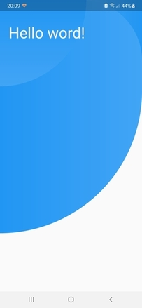
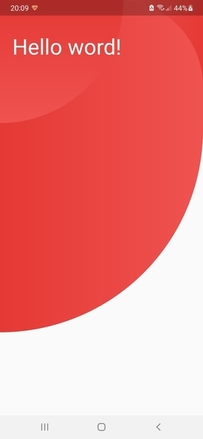
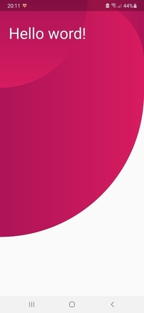

# Circles Background

A simple backround design package to make your app look beautiful.

## Features

Creates a nice and simple background design, you can use our two classes.

The first class is `ThreeCirclesBackground` witch lets you use our defult circles background design. You can customize it using the pramater `gradientColor`.
It can be set to `GradientColor.blue`, `GradientColor.red` or `GradientColor.custom`. If you choose the custom one you need also to provide the pramater `colors`, 
The colors are used for the circles gradient. It should be 3 lists long, and each list should contain at least two colors.

##### `GradientColor.blue`



##### `GradientColor.red`



##### `GradientColor.custom`



The second class is `CirclesBackground`. This one takes only one pramater `circles`. You need to provide a list of `CircleInfo` - a class that takes: size, color, turns, 
alignment, borderRadius, gradient.

##### `CirclesBackground example`


## Usage

You can import the package with:

```dart
import 'package:circles_background/circles_background.dart';
```

Use it as follows:

##### `CirclesBackgroundPage`

```dart
class CirclesBackgroundPage extends StatelessWidget {
  CirclesBackgroundPage({Key? key}) : super(key: key);

  final List<CircleInfo> circles = [
    CircleInfo(
        size: const Size(300, 500),
        color: Colors.green,
        borderRadius: const BorderRadius.only(bottomLeft: Radius.circular(200)),
        alignment: Alignment.topRight
    ),
    CircleInfo(
        size: const Size(300, 900),
        gradient: LinearGradient(
            begin: Alignment.topCenter,
            end: Alignment.bottomCenter,
            colors: [Colors.green[800]!, Colors.green]
        ),
        borderRadius: const BorderRadius.only(),
        alignment: Alignment.topLeft
    ),
    CircleInfo(
        size: const Size(200, 500),
        gradient: LinearGradient(
            begin: Alignment.topCenter,
            end: Alignment.bottomCenter,
            colors: [Colors.green[800]!, Colors.green]
        ),
        borderRadius: const BorderRadius.only(bottomLeft: Radius.circular(50), topLeft: Radius.circular(150)),
        alignment: Alignment.bottomRight
    ),
  ];

  @override
  Widget build(BuildContext context) {
    return Scaffold(
      body: CirclesBackground(
        circles: circles,
        child: const Padding(
          padding: EdgeInsets.symmetric(vertical: 70, horizontal: 25),
          child: Text('Hello word!', style: TextStyle(
            color: Colors.white,
            fontSize: 40
          ),),
        ),
      ),

    );
  }
}
```

##### `ThreeCirclesBackgroundPage`

```dart
class ThreeCirclesBackgroundPage extends StatelessWidget {
  final GradientColor gradientColor;
  const ThreeCirclesBackgroundPage(this.gradientColor, {Key? key}) : super(key: key);

  @override
  Widget build(BuildContext context) {
    return Scaffold(
      body: ThreeCirclesBackground(
        gradientColor: gradientColor,
        customColors: getCustomColors(),
        sizeOfScreen: MediaQuery.of(context).size,
        child: const Padding(
          padding: EdgeInsets.symmetric(vertical: 70, horizontal: 25),
          child: Text('Hello word!', style: TextStyle(
              color: Colors.white,
              fontSize: 40
          ),),
        ),
      ),

    );
  }

  List<List<Color>>? getCustomColors() {
    if (gradientColor == GradientColor.custom) {
      return [
        [Colors.pink[700]!, Colors.pink[900]!],
        [Colors.pink[700]!, Colors.pink[900]!],
        [Colors.pink[700]!, Colors.pink[900]!],
      ];
    }
  }
}
```


##### Full code `main.dart`

```dart
import 'package:flutter/material.dart';
import 'package:circles_background/circles_background.dart';

void main() {
  runApp(const MyApp());
}

class MyApp extends StatelessWidget {
  const MyApp({Key? key}) : super(key: key);

  @override
  Widget build(BuildContext context) {
    return MaterialApp(
      title: 'Circles Background',
      theme: ThemeData(
        primarySwatch: Colors.blue,
      ),
      debugShowCheckedModeBanner: false,
      home: CirclesBackgroundPage(),
      //home: const ThreeCirclesBackgroundPage(GradientColor.blue),
      //home: const ThreeCirclesBackgroundPage(GradientColor.red),
      //home: const ThreeCirclesBackgroundPage(GradientColor.custom),
    );
  }
}

class CirclesBackgroundPage extends StatelessWidget {
  CirclesBackgroundPage({Key? key}) : super(key: key);

  final List<CircleInfo> circles = [
    CircleInfo(
        size: const Size(300, 500),
        color: Colors.green,
        borderRadius: const BorderRadius.only(bottomLeft: Radius.circular(200)),
        alignment: Alignment.topRight
    ),
    CircleInfo(
        size: const Size(300, 900),
        gradient: LinearGradient(
            begin: Alignment.topCenter,
            end: Alignment.bottomCenter,
            colors: [Colors.green[800]!, Colors.green]
        ),
        borderRadius: const BorderRadius.only(),
        alignment: Alignment.topLeft
    ),
    CircleInfo(
        size: const Size(200, 500),
        gradient: LinearGradient(
            begin: Alignment.topCenter,
            end: Alignment.bottomCenter,
            colors: [Colors.green[800]!, Colors.green]
        ),
        borderRadius: const BorderRadius.only(bottomLeft: Radius.circular(50), topLeft: Radius.circular(150)),
        alignment: Alignment.bottomRight
    ),
  ];

  @override
  Widget build(BuildContext context) {
    return Scaffold(
      body: CirclesBackground(
        circles: circles,
        child: const Padding(
          padding: EdgeInsets.symmetric(vertical: 70, horizontal: 25),
          child: Text('Hello word!', style: TextStyle(
            color: Colors.white,
            fontSize: 40
          ),),
        ),
      ),

    );
  }
}

class ThreeCirclesBackgroundPage extends StatelessWidget {
  final GradientColor gradientColor;
  const ThreeCirclesBackgroundPage(this.gradientColor, {Key? key}) : super(key: key);

  @override
  Widget build(BuildContext context) {
    return Scaffold(
      body: ThreeCirclesBackground(
        gradientColor: gradientColor,
        customColors: getCustomColors(),
        sizeOfScreen: MediaQuery.of(context).size,
        child: const Padding(
          padding: EdgeInsets.symmetric(vertical: 70, horizontal: 25),
          child: Text('Hello word!', style: TextStyle(
              color: Colors.white,
              fontSize: 40
          ),),
        ),
      ),

    );
  }

  List<List<Color>>? getCustomColors() {
    if (gradientColor == GradientColor.custom) {
      return [
        [Colors.pink[700]!, Colors.pink[900]!],
        [Colors.pink[700]!, Colors.pink[900]!],
        [Colors.pink[700]!, Colors.pink[900]!],
      ];
    }
  }
}
```

## Additional information

Privacy guard - protect you privacy is the best design example for this package.
See at - [Google Play](https://play.google.com/store/apps/details?id=com.privacy.guard), [App Store](https://apps.apple.com/us/app/privacy-guard-be-private/id1576056112)

